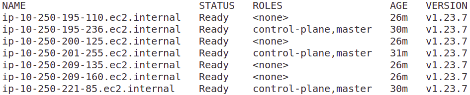

# kubespray-k8s-aws-cluster

Kubernetes cluster provisioned on AWS EC2 instances via Kubespray tool


This project based on the original AWS template from Kubespray project: [https://github.com/kubernetes-sigs/kubespray/tree/master/contrib/terraform/aws](https://github.com/kubernetes-sigs/kubespray/tree/master/contrib/terraform/aws)

## Clone the Kubespray project
To get all the required files, clone the Kubespray project into the root of your local workspace:
```bash
git clone git@github.com:kubernetes-sigs/kubespray.git
```

**NOTE**:  
The kubespray project was added as submodule to the current project 


To use specific release of Kubespray:
```bash
git checkout release-<version>
```

For example:
```bash
git checkout release-2.19
```

## Install required dependencies

```bash
cd kubespray/
```

```bash
pip3 install  -r ./requirements.txt
```

## Create SSH keys in AWS account via AWS CLI
Go to the `aws` folder:
```bash
cd contrib/terraform/aws
```

To create SSH keys use the following command:
```bash
aws ec2 create-key-pair --key-name kubespray-ssh-key --region us-east-1 --query 'KeyMaterial' --output text > kubespray-ssh-key.pem
chmod 400 kubespray-ssh-key.pem
```

## Export TF variables

Before initializing Terraform project and creating the underlying infrastructure, set these required environment variables:
```bash
export TF_VAR_AWS_ACCESS_KEY_ID="<your_access_key_id>"
export TF_VAR_AWS_SECRET_ACCESS_KEY="<your_secret_access_key>"
export TF_VAR_AWS_SSH_KEY_NAME="kubespray-ssh-key"
export TF_VAR_AWS_DEFAULT_REGION="us-east-1"
```

## Create the AWS infrastructure
1. Initialize the Terraform project:
```bash
cd contrib/terraform/aws
terraform init
```
2. Review and apply:
```bash
terraform apply
```

By default Kubepsray AWS template project creates EC2 instances based on `Ubuntu 18.04`

## Use SSH agent forwarding

1. Start the SSH agent on your local machine:
```bash
eval $(ssh-agent -s)
```
2. Add your private key to the SSH agent:
```bash
ssh-add /path/to/your/private/key
```
3. To connect to the private EC2 instances via the Bastion host use the following command:
```bash
ssh -A -t admin@BastionHostPublicIP ssh admin@PrivateInstancePrivateIP
```

`-A` enables forwarding of the SSH authentication agent connection.  
`-t` forces pseudo-terminal allocation, which is necessary for interactive sessions.

## Provision cluster with Kubespray Ansible Playbook:
Go to the root of the Kubespray project:
```bash
cd kubespray/
```
Run the playbook:
```bash
ansible-playbook -i ./inventory/hosts ./cluster.yml -e ansible_user=admin -b --become-user=root --flush-cache
```

## Connecting to Kubernetes
You can use the following set of commands to get the kubeconfig file from your newly created cluster. Before running the commands, make sure you are in the project's root folder.

```bash
# Get the controller's IP address.
CONTROLLER_HOST_NAME=$(cat ./inventory/hosts | grep "\[kube_control_plane\]" -A 1 | tail -n 1)
CONTROLLER_IP=$(cat ./inventory/hosts | grep $CONTROLLER_HOST_NAME | grep ansible_host | cut -d'=' -f2)

# Get the hostname of the load balancer.
LB_HOST=$(cat inventory/hosts | grep apiserver_loadbalancer_domain_name | cut -d'"' -f2)

# Get the controller's SSH fingerprint.
ssh-keygen -R $CONTROLLER_IP > /dev/null 2>&1
ssh-keyscan -H $CONTROLLER_IP >> ~/.ssh/known_hosts 2>/dev/null

# Get the kubeconfig from the controller.
mkdir -p ~/.kube
ssh -F ssh-bastion.conf admin@$CONTROLLER_IP "sudo chmod 644 /etc/kubernetes/admin.conf"
scp -F ssh-bastion.conf admin@$CONTROLLER_IP:/etc/kubernetes/admin.conf ~/.kube/config
sed -i "s^server:.*^server: https://$LB_HOST:6443^" ~/.kube/config
kubectl get nodes
```



## References
1. [https://github.com/kubernetes-sigs/kubespray](https://github.com/kubernetes-sigs/kubespray)
2. [Kubecost blog: Kubespray: Production Grade Clusters Made Easy](https://www.kubecost.com/kubernetes-devops-tools/kubespray/)